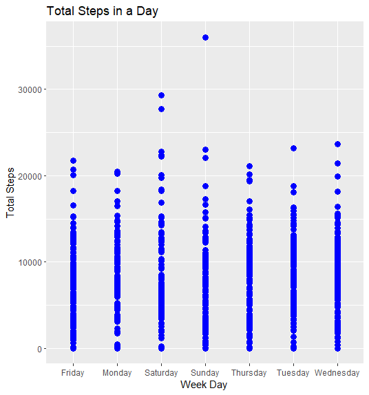
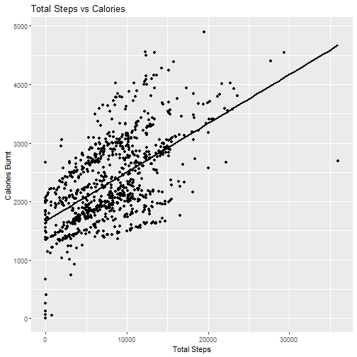
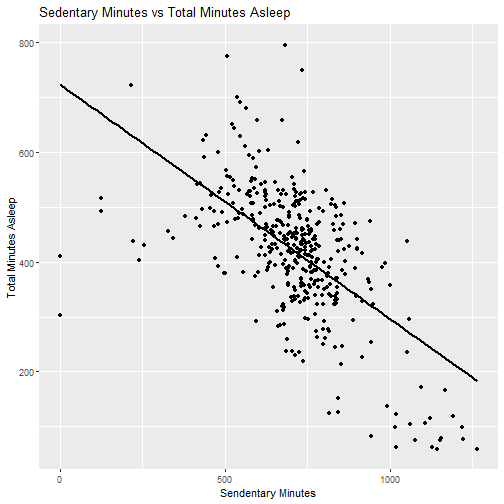
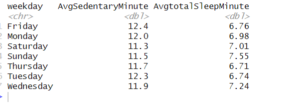
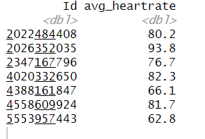
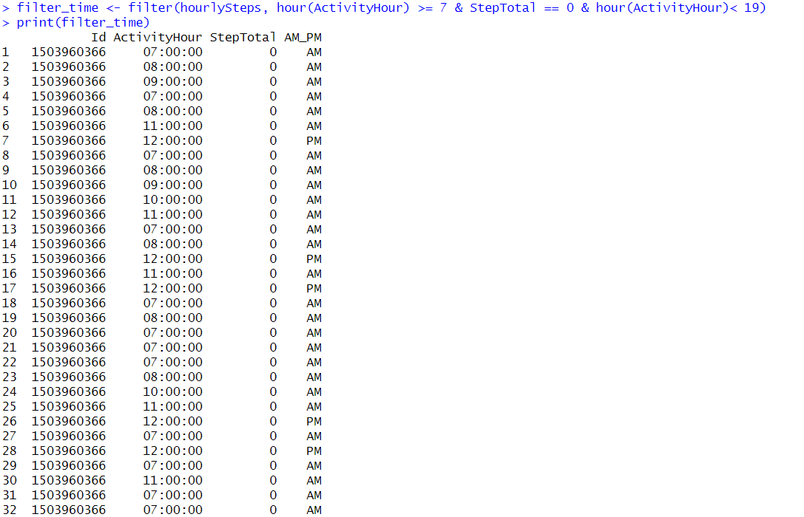
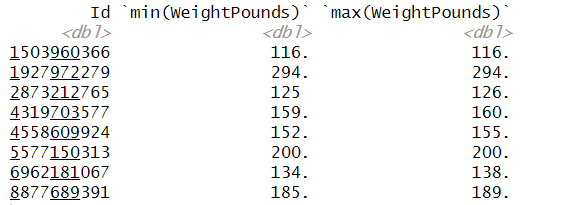

## Bellabeat Marketing Strategy Analysis
<p>
<h3><strong>Content:</strong></h3>
<li>Introduction </li>
<li>Summary of business task</li> 
<li>Description of Data Sources</li>
<li>Data Cleaning</li>
<li>Analysis</li>
<li>Recommendation</li></ul>

<h3><strong>Introduction:</strong></h3>
In this capstone project, I am assigned as a junior data analyst at the marketing team of Bellabeat to help them unlock new growth opportunities in the smart device market. 

<h3><strong>Bellabeat Overview:</strong></h3>
<ul>
<li><i>Manufacturer of health-focused smart products for Women</i></li>
<li><i>Some of their products includes Bellabeat app, Leaf (wellness tracker), smart watch, water bottle (hydration tracker), Bellabeat Membership subscriptions</i></li>
<li><i>Marketing wise the company has highly invested in digital marketing which includes Google search, Facebook and Instagram pages, Twitter, and YouTube ads</i></li></ul>

<h3><strong>Business Task:</strong></h3>
<ul>
<li>Find trends in the usage of smart devices to gain insight on non-Bellabeat users and how the marketing team at Bellabeat convert these users into customers</li>

<li>How these insights on the non-Bellabeat usage of smart devices will help market the Bella beat app to women</li></ul>

<h3><strong>Key Stakeholders:</strong></h3>
<ul>
<li>Urska Srsen: Bellabeat’s Cofounder and Chief Creative Officer</li>
<li>Sando Mur: Cofounder and Member of Executive team</li>
<li>Bellabeat Marketing analytics tea.: A team of data analyst responsible for collecting, analyzing, and reporting the data that helps coin the Bellabeat’s marketing strategy</li></ul>

<h3><strong>Data Source</strong></h3>
The public dataset Fitbit Fitness Tracker by Mobius is downloaded from Kaggle. It contains personal tracker data about thirty Fitbit users. It includes information about daily activity, steps, and heart rate that can be used to explore users’ habits. However, this dataset has limitation of small sample size and only 2 months of tracked data. 
Location: The data is available on Kaggle.com in a zip file containing 18 CSV files about daily user’s activities for 2 months in the year 2016. 

<h4>Listed are the CSV files used for this analysis: </h4>
<ul>
<li>dailyActivity_merged</li>
<li>sleepDay_merged </li>
<li>heartrate_seconds_merged</li>
<li>hourlySteps_merged</li>
<li>weightLogInfo_merge</li></ul>

<h3><strong>Data Cleaning</strong></h3>
Loaded the 7 CSV files in R studio by installing the readr package. 

</p>

```r
install.packages("tidyverse")
library(tidyverse)
install.packages("readr")
library(readr)
library(dplyr)
library(ggplot2)
library(lubridate)
library(data.table)
```
<p>Installed tidyverse package and used the functions below to get the overview of the datasets structure, content, and summary.</p>

```r
dailyActivity <- read.csv("C:\\Users\\Navee\\OneDrive\\Documents\\Google Data Analysis\\Fitabase Data 4.12.16-5.12.16\\dailyActivity_merged.csv")
head(dailyActivity)
str(dailyActivity)
summary(dailyActivity)

sleepDay <- read.csv("C:\\Users\\Navee\\OneDrive\\Documents\\Google Data Analysis\\Fitabase Data 4.12.16-5.12.16\\sleepDay_merged.csv")
head(sleepDay)
str(sleepDay)
summary(sleepDay)

weightLog <- read.csv("C:\\Users\\Navee\\OneDrive\\Documents\\Google Data Analysis\\Fitabase Data 4.12.16-5.12.16\\weightLogInfo_merged.csv")
head(weightLog)
str(weightLog)
summary(weightLog)

heartrateInSec <- read.csv("C:\\Users\\Navee\\OneDrive\\Documents\\Google Data Analysis\\Fitabase Data 4.12.16-5.12.16\\heartrate_seconds_merged.csv")
head(heartrateInSec)
str(heartrateInSec)

hourlySteps <- read.csv("C:\\Users\\Navee\\OneDrive\\Documents\\Google Data Analysis\\Fitabase Data 4.12.16-5.12.16\\hourlySteps_merged.csv")
head(hourlySteps)
str(hourlySteps)
```
<p>Data and time fields were changed from char to Date and Time data type in each data set. 
Integer and float fields were changed from char to Int and Num data types in each data set. 
Each data set was checked for null value in all the fields and trailing white spaces were removed from all the fields.</p>

```r
##Checks for missing values in each columns 
colSums(is.na(dailyActivity))  

##Remove leading and trailing white space from the column
dailyActivity$Id <- trimws(dailyActivity$Id)
dailyActivity$ActivityDate <- trimws(dailyActivity$ActivityDate)
dailyActivity$TotalSteps <- trimws(dailyActivity$TotalSteps)
dailyActivity$TotalDistance <- trimws(dailyActivity$TotalDistance)
dailyActivity$TrackerDistance <- trimws(dailyActivity$TrackerDistance)
dailyActivity$LoggedActivitiesDistance <- trimws(dailyActivity$LoggedActivitiesDistance)
dailyActivity$VeryActiveDistance <- trimws(dailyActivity$VeryActiveDistance)
dailyActivity$ModeratelyActiveDistance <- trimws(dailyActivity$ModeratelyActiveDistance)
dailyActivity$LightActiveDistance <- trimws(dailyActivity$LightActiveDistance)
dailyActivity$SedentaryActiveDistance <- trimws(dailyActivity$SedentaryActiveDistance)
dailyActivity$VeryActiveMinutes<- trimws(dailyActivity$VeryActiveMinutes)
dailyActivity$FairlyActiveMinutes <- trimws(dailyActivity$FairlyActiveMinutes)
dailyActivity$LightlyActiveMinutes <- trimws(dailyActivity$LightlyActiveMinutes)
dailyActivity$SedentaryMinutes <- trimws(dailyActivity$SedentaryMinutes)
dailyActivity$Calories <- trimws(dailyActivity$Calories)

##AcitivityDate data type conversion from char to date and changing char data type to num  
library(lubridate)
dailyActivity$ActivityDate <- mdy(dailyActivity$ActivityDate)
dailyActivity$weekday <- weekdays(dailyActivity$ActivityDate)
dailyActivity$Id<- gsub(",", "", dailyActivity$Id)     
dailyActivity$Id <- as.numeric(dailyActivity$Id)
dailyActivity$TotalSteps <- as.numeric(dailyActivity$TotalSteps)
dailyActivity$TotalDistance <- as.numeric(dailyActivity$TotalDistance)
dailyActivity$TrackerDistance <- as.numeric(dailyActivity$TrackerDistance)
dailyActivity$LoggedActivitiesDistance <- as.numeric(dailyActivity$LoggedActivitiesDistance)
dailyActivity$VeryActiveDistance <- as.numeric(dailyActivity$VeryActiveDistance)
dailyActivity$ModeratelyActiveDistance <- as.numeric(dailyActivity$ModeratelyActiveDistance)
dailyActivity$LightActiveDistance <- as.numeric(dailyActivity$LightActiveDistance)
dailyActivity$SedentaryActiveDistance <- as.numeric(dailyActivity$SedentaryActiveDistance)
dailyActivity$VeryActiveMinutes <- as.numeric(dailyActivity$VeryActiveMinutes)
dailyActivity$FairlyActiveMinutes <- as.numeric(dailyActivity$FairlyActiveMinutes)
dailyActivity$LightlyActiveMinutes <- as.numeric(dailyActivity$LightlyActiveMinutes)
dailyActivity$SedentaryMinutes <- as.numeric(dailyActivity$SedentaryMinutes)
dailyActivity$Calories <- as.numeric(dailyActivity$Calories)
```
<p>
<h3><strong>Analysis</strong></h3>
Initial analysis included calculating aggregated functions on key fields of data sets.

```r
#Average Total Steps, Total Distance and Total Calories 
mean(dailyActivity$TotalSteps)
mean(dailyActivity$TotalDistance)
mean(dailyActivity$Calories)
```


```r
##Most Active days and least active days
average_active_time <- dailyActivity %>%
  group_by(weekday) %>%
  summarize(AvgTotalSteps = mean(TotalSteps), AvgVeryActiveMinute = mean(VeryActiveMinutes), AvgCaloriesBurn = mean(Calories))
print(average_active_time)
```


```r
## Total steps grouped by weekday
ggplot(dailyActivity, aes(x = dailyActivity$weekday, y=dailyActivity$TotalSteps)) +
  geom_point(color = "blue", size = 3) +
  labs(title = "Total Steps in a Day", x = "Week Day ", y = "Total Steps")
```


```r 
#Average Sleeping hours 
round(mean(sleepDay$TotalMinutesAsleep)/60)
```


<h5>Observation based on the calculation:</h5>
<ul><li>Average total steps taken by the participant is 7638 and Total distance walked </li>
<li>Average calories burned by the participant is 2304</li>
<li>Participants are most active on Saturday with average total steps of 8153 and least active on Sunday and Thursday with average total steps of 6933 and 7406</li>
<li>On average participant slept for 7hrs</li>
<li>No drastic weight change among the 8 participants who logged their weight</li>
</ul>

There is a positive correlation between Total steps and Calories burnt. 
```r
#Corrolation between Total steps vs Calories burnt 
  ggplot(dailyActivity, aes(x=TotalSteps, y=Calories)) + geom_point() +  geom_smooth(method = "lm", se = FALSE, color = "black") +
    labs(title = 'Total Steps vs Calories', x= 'Total Steps', y = 'Calories Burnt')
```


The above graph shows more calories are burnt when the step count are higher. The participants needs to walk more in loose calories. 

There is a negative correlation between the number of sedentary minutes versus total minutes asleep. This concludes that the higher the number of hours asleep, lesser amount of time spent sedentary. 
Note that the `echo = FALSE` parameter was added to the code chunk to prevent printing of the R code that generated the plot.

```r
#changing col name of date to match in both dataset 
colnames(dailyActivity)[2]  <- "Date" 
colnames(sleepDay)[2] <- "Date"

#Merging sleep and activity levels 
df_merge <- merge(dailyActivity, sleepDay, by = c("Id", "Date"))

## Graph of Sedentary Minutes vs Total Time Asleep
ggplot(df_merge, aes(x=SedentaryMinutes, y=TotalMinutesAsleep)) +
geom_point() + geom_smooth(method = "lm", se = FALSE, color = "black") +
  labs(title = 'Sedentary Minutes vs Total Minutes Asleep', x= 'Sendentary Minutes', y = 'Total Minutes Asleep')
```




We could also see that participants are more active on weekends compared to weekdays and they slept more on weekends versus weekdays. 

```r
#Calculate average sedentary minutes, total minutes asleep by day 
average_sedentary_time <- df_merge %>%
  group_by(weekday) %>%
  summarize(AvgSedentaryMinute = mean(SedentaryMinutes)/60, AvgtotalSleepMinute = mean(TotalMinutesAsleep)/60)
print(average_sedentary_time)
```


Only seven participants recorded their heartrate which does not give us clear picture about their heartrate range when they are very active. Additionally, we do not know their age to see if their heart rate falls in normal range depending upon their age. 

```r
##Average heart rate group by ID
average_heartrate <- heartrateInSec %>%
  group_by(Id) %>%
  summarize(avg_heartrate = mean(Value))
  print(average_heartrate)
```


In the HourlyStep dataset we could use the filter function to figure out the time when the participants are least active and send a reminder every 2hr between 7am to 7pm

```r
##Converting Active hours from char to time data type

hourlySteps$ActivityHour <- as.ITime(hourlySteps$ActivityHour)
hourlySteps$AM_PM <- ifelse(hour(hourlySteps$ActivityHour) < 12, " AM", " PM")
View(hourlySteps)

filter_time <- filter(hourlySteps, hour(ActivityHour) >= 7 & StepTotal == 0 & hour(ActivityHour)< 19)
 print(filter_time)
 ```
 

 
There was no drastic change in the weight of the participants who logged their weight daily for 2 months and only 8 participants have logged their weight. Thus, we could not find any significant statistical pattern in the data set. Additional data is needed to make any analytic conclusion. 

```r
weightLog%>%
  group_by(Id)%>%
  summarise(min(WeightPounds),max(WeightPounds))
  ```


<h3><strong>Recommendation</strong></h3>
Bella Beats should focus on marketing more customized fitness plans tailored specifically for their female consumers. These plans should be designed to accommodate their individual routines, age, fitness levels, and body types.
<br>
<br>
According to the National Institution of Health, he recommended daily step count for an average person is 
10,000 steps. However, our participants' average total steps taken per day is 7,638, falling short of the recommended target. Additionally, women should ideally get 8 to 9 hours of sleep per night, yet our participants are only averaging 7 hours of sleep.
<br>
<br>
To address these issues, the app should incorporate hourly reminders to encourage users to achieve their daily goal of 10,000 steps, especially during periods of lower activity throughout the day. In addition, daily notification should prompt users to prioritize getting enough sleep to reach the recommended 9 hours.  Since participants are more active on weekends compared to weekdays, reminders and notifications should be intensified on Thursdays and Sundays, when they tend to be less active and sleep-deprived. Our analysis indicates that participants were more active when they had adequate hours of sleep. 
<br>
<br>
The next step involves collecting more comprehensive data from a larger sample size over a period of at least one year. This data set should include additional variables such as age, weight, height, heart rate during active and rest periods. 
<br>
Furthermore, Bella beat should consider collecting data on women menstrual cycles to provide customized exercise routine, fitness plan, and meditation session depending on individual fitness and health goals. This personalized approach will enhance user engagement and satisfaction while promoting healthier lifestyle habits among female users.
</p>
</body>
  
