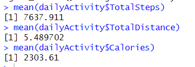
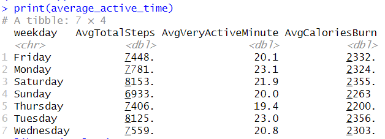

## Bellabeat Marketing Strategy Analysis
<p>
<h3><strong>Content:</strong></h3>
<li>Introduction </li>
<li>Summary of business task</li> 
<li>Description of Data Sources</li>
<li>Data Cleaning</li>
<li>Analysis</li>
<li>Recommendation</li></ul>

<h3><strong>Introduction:</strong></h3>
In this capstone project, I am assigned as a junior data analyst at the marketing team of Bellabeat to help them unlock new growth opportunities in the smart device market. 

<h3><strong>Bellabeat Overview:</strong></h3>
<ul>
<li><i>Manufacturer of health-focused smart products for Women</i></li>
<li><i>Some of their products includes Bellabeat app, Leaf (wellness tracker), smart watch, water bottle (hydration tracker), Bellabeat Membership subscriptions</i></li>
<li><i>Marketing wise the company has highly invested in digital marketing which includes Google search, Facebook and Instagram pages, Twitter, and YouTube ads</i></li></ul>

<h3><strong>Business Task:</strong></h3>
<ul>
<li>Find trends in the usage of smart devices to gain insight on non-Bellabeat users and how the marketing team at Bellabeat convert these users into customers</li>

<li>How these insights on the non-Bellabeat usage of smart devices will help market the Bella beat app to women</li></ul>

<h3><strong>Key Stakeholders:</strong></h3>
<ul>
<li>Urska Srsen: Bellabeat’s Cofounder and Chief Creative Officer</li>
<li>Sando Mur: Cofounder and Member of Executive team</li>
<li>Bellabeat Marketing analytics tea.: A team of data analyst responsible for collecting, analyzing, and reporting the data that helps coin the Bellabeat’s marketing strategy</li></ul>

<h3><strong>Data Source</strong></h3>
The public dataset Fitbit Fitness Tracker by Mobius is downloaded from Kaggle. It contains personal tracker data about thirty Fitbit users. It includes information about daily activity, steps, and heart rate that can be used to explore users’ habits. However, this dataset has limitation of small sample size and only 2 months of tracked data. 
Location: The data is available on Kaggle.com in a zip file containing 18 CSV files about daily user’s activities for 2 months in the year 2016. 

<h4>Listed are the CSV files used for this analysis: </h4>
<ul>
<li>dailyActivity_merged</li>
<li>sleepDay_merged </li>
<li>heartrate_seconds_merged</li>
<li>hourlySteps_merged</li>
<li>weightLogInfo_merge</li></ul>

<h3><strong>Data Cleaning</strong></h3>
Loaded the 7 CSV files in R studio by installing the readr package. 

</p>

```r
install.packages("tidyverse")
library(tidyverse)
install.packages("readr")
library(readr)
library(dplyr)
library(ggplot2)
library(lubridate)
library(data.table)
```
<p>Installed tidyverse package and used the functions below to get the overview of the datasets structure, content, and summary.</p>

```r
dailyActivity <- read.csv("C:\\Users\\Navee\\OneDrive\\Documents\\Google Data Analysis\\Fitabase Data 4.12.16-5.12.16\\dailyActivity_merged.csv")
head(dailyActivity)
str(dailyActivity)
summary(dailyActivity)

sleepDay <- read.csv("C:\\Users\\Navee\\OneDrive\\Documents\\Google Data Analysis\\Fitabase Data 4.12.16-5.12.16\\sleepDay_merged.csv")
head(sleepDay)
str(sleepDay)
summary(sleepDay)

weightLog <- read.csv("C:\\Users\\Navee\\OneDrive\\Documents\\Google Data Analysis\\Fitabase Data 4.12.16-5.12.16\\weightLogInfo_merged.csv")
head(weightLog)
str(weightLog)
summary(weightLog)

heartrateInSec <- read.csv("C:\\Users\\Navee\\OneDrive\\Documents\\Google Data Analysis\\Fitabase Data 4.12.16-5.12.16\\heartrate_seconds_merged.csv")
head(heartrateInSec)
str(heartrateInSec)

hourlySteps <- read.csv("C:\\Users\\Navee\\OneDrive\\Documents\\Google Data Analysis\\Fitabase Data 4.12.16-5.12.16\\hourlySteps_merged.csv")
head(hourlySteps)
str(hourlySteps)
```
<p>Data and time fields were changed from char to Date and Time data type in each data set. 
Integer and float fields were changed from char to Int and Num data types in each data set. 
Each data set was checked for null value in all the fields and trailing white spaces were removed from all the fields.</p>

```r
##Checks for missing values in each columns 
colSums(is.na(dailyActivity))  

##Remove leading and trailing white space from the column
dailyActivity$Id <- trimws(dailyActivity$Id)
dailyActivity$ActivityDate <- trimws(dailyActivity$ActivityDate)
dailyActivity$TotalSteps <- trimws(dailyActivity$TotalSteps)
dailyActivity$TotalDistance <- trimws(dailyActivity$TotalDistance)
dailyActivity$TrackerDistance <- trimws(dailyActivity$TrackerDistance)
dailyActivity$LoggedActivitiesDistance <- trimws(dailyActivity$LoggedActivitiesDistance)
dailyActivity$VeryActiveDistance <- trimws(dailyActivity$VeryActiveDistance)
dailyActivity$ModeratelyActiveDistance <- trimws(dailyActivity$ModeratelyActiveDistance)
dailyActivity$LightActiveDistance <- trimws(dailyActivity$LightActiveDistance)
dailyActivity$SedentaryActiveDistance <- trimws(dailyActivity$SedentaryActiveDistance)
dailyActivity$VeryActiveMinutes<- trimws(dailyActivity$VeryActiveMinutes)
dailyActivity$FairlyActiveMinutes <- trimws(dailyActivity$FairlyActiveMinutes)
dailyActivity$LightlyActiveMinutes <- trimws(dailyActivity$LightlyActiveMinutes)
dailyActivity$SedentaryMinutes <- trimws(dailyActivity$SedentaryMinutes)
dailyActivity$Calories <- trimws(dailyActivity$Calories)

##AcitivityDate data type conversion from char to date and changing char data type to num  
library(lubridate)
dailyActivity$ActivityDate <- mdy(dailyActivity$ActivityDate)
dailyActivity$weekday <- weekdays(dailyActivity$ActivityDate)
dailyActivity$Id<- gsub(",", "", dailyActivity$Id)     
dailyActivity$Id <- as.numeric(dailyActivity$Id)
dailyActivity$TotalSteps <- as.numeric(dailyActivity$TotalSteps)
dailyActivity$TotalDistance <- as.numeric(dailyActivity$TotalDistance)
dailyActivity$TrackerDistance <- as.numeric(dailyActivity$TrackerDistance)
dailyActivity$LoggedActivitiesDistance <- as.numeric(dailyActivity$LoggedActivitiesDistance)
dailyActivity$VeryActiveDistance <- as.numeric(dailyActivity$VeryActiveDistance)
dailyActivity$ModeratelyActiveDistance <- as.numeric(dailyActivity$ModeratelyActiveDistance)
dailyActivity$LightActiveDistance <- as.numeric(dailyActivity$LightActiveDistance)
dailyActivity$SedentaryActiveDistance <- as.numeric(dailyActivity$SedentaryActiveDistance)
dailyActivity$VeryActiveMinutes <- as.numeric(dailyActivity$VeryActiveMinutes)
dailyActivity$FairlyActiveMinutes <- as.numeric(dailyActivity$FairlyActiveMinutes)
dailyActivity$LightlyActiveMinutes <- as.numeric(dailyActivity$LightlyActiveMinutes)
dailyActivity$SedentaryMinutes <- as.numeric(dailyActivity$SedentaryMinutes)
dailyActivity$Calories <- as.numeric(dailyActivity$Calories)
```
<p>
<h3><strong>Analysis</strong></h3>
Initial analysis included calculating aggregated functions on key fields of data sets.

```r
#Average Total Steps, Total Distance and Total Calories 
mean(dailyActivity$TotalSteps)
mean(dailyActivity$TotalDistance)
mean(dailyActivity$Calories)
```



```r
##Most Active days and least active days
average_active_time <- dailyActivity %>%
  group_by(weekday) %>%
  summarize(AvgTotalSteps = mean(TotalSteps), AvgVeryActiveMinute = mean(VeryActiveMinutes), AvgCaloriesBurn = mean(Calories))
print(average_active_time)
```



```r
## Total steps grouped by weekday
ggplot(dailyActivity, aes(x = dailyActivity$weekday, y=dailyActivity$TotalSteps)) +
  geom_point(color = "blue", size = 3) +
  labs(title = "Total Steps in a Day", x = "Week Day ", y = "Total Steps")
```
